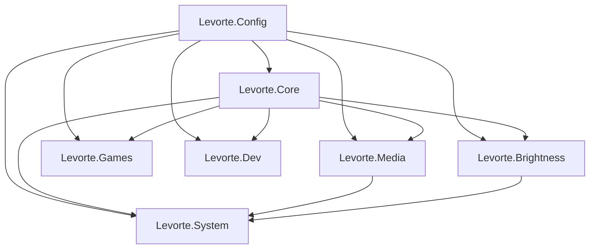

# Архитектура

## Структура каталогов

```
switcher/
├── app/                    # Исходники Levorte
│   ├── Levorte.ahk         # Точка входа, #Include модулей
│   ├── Levorte.Config.ahk  # Константы и пути
│   ├── Levorte.Core.ahk    # Инициализация, общие хоткеи, утилиты
│   ├── Levorte.Games.ahk   # Path of Exile
│   ├── Levorte.TextTools.ahk
│   ├── Levorte.Media.ahk   # Громкость, Яндекс Музыка
│   ├── Levorte.System.ahk  # IP, архивы, схемы питания
│   ├── Levorte.Brightness.ahk
│   ├── Levorte.Dev.ahk       # HMI / dotnet
│   ├── brightness/
│   │   └── auto_brightness.py
│   └── icon.ico
├── build/                  # Levorte.exe (не в git)
├── doc/                    # Документация
├── scripts/
│   └── Compile-Levorte.ps1
└── tools/
    ├── BinMod.ahk          # Пост-обработка exe
    └── *.exe               # Локальные бинарники (не в git)
```

## Порядок подключения модулей

```ahk
#Include Levorte.Config.ahk    ; константы
#Include Levorte.Core.ahk      ; admin, общие функции
#Include Levorte.Games.ahk
#Include Levorte.TextTools.ahk
#Include Levorte.Media.ahk
#Include Levorte.System.ahk     ; использует GetMonitorIndexAtPoint из Media
#Include Levorte.Brightness.ahk ; SetBrightnessLevel вызывается из System
#Include Levorte.Dev.ahk
```

## Ключевые потоки

### Яркость

1. `AdjustBrightness` — быстрый WMI + очередь Python (debounce 80 мс)
2. `SetBrightnessLevel` — синхронная установка на все мониторы
3. При смене схемы питания: `GetEffectiveBrightness` → `powercfg` → `SetBrightnessLevel`

### Распаковка архивов

1. `Alt + СКМ` → отложенный таймер (отпускание Alt)
2. COM / Ctrl+C / синтетический клик для получения путей
3. `GetArchiveExtractFolderPath` → 7-Zip / PowerShell / tar

### Громкость

Custom GUI tooltip с позиционированием через `GetCursorScreenPos` (экранные координаты, мультимонитор).

## Зависимости между модулями



## Сборка exe

`Levorte.ahk` содержит директивы Ahk2Exe: `RequireAdmin`, иконка, `PostExec` с BinMod для модификации бинарника.
