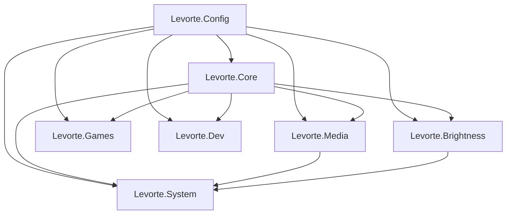

# Архитектура

## Структура каталогов

```
switcher/
├── app/                    # Исходники Levorte
│   ├── Levorte.ahk         # Точка входа, #Include модулей
│   ├── Levorte.Config.ahk  # Константы и пути
│   ├── Levorte.Core.ahk    # Инициализация, общие хоткеи, утилиты
│   ├── Levorte.Games.ahk   # Path of Exile / Torchlight
│   ├── Levorte.TextTools.ahk
│   ├── Levorte.Media.ahk   # Громкость, Яндекс Музыка
│   ├── Levorte.System.ahk  # IP, scp из проводника, схемы питания
│   ├── Levorte.Brightness.ahk
│   ├── Levorte.Dev.ahk       # HMI / dotnet
│   ├── Levorte.Macro.ahk     # Запись и воспроизведение макросов
│   ├── brightness/
│   │   └── auto_brightness.py
│   └── icon.ico
├── build/                  # Levorte.exe (не в git)
├── logs/                   # Логи сборок HMI (не в git)
├── doc/                    # Документация
├── scripts/
│   └── Compile-Levorte.ps1
└── tools/
    ├── BinMod.ahk          # Пост-обработка exe
    └── *.exe               # Локальные бинарники (не в git)
```

## Порядок подключения модулей

```ahk
#Include Levorte.Config.ahk    ; константы
#Include Levorte.Core.ahk      ; admin, общие функции
#Include Levorte.Games.ahk
#Include Levorte.TextTools.ahk
#Include Levorte.Media.ahk
#Include Levorte.System.ahk     ; использует GetMonitorIndexAtPoint из Media
#Include Levorte.Brightness.ahk ; SetBrightnessLevel вызывается из System
#Include Levorte.Dev.ahk
#Include Levorte.Macro.ahk
```

## Ключевые потоки

### Яркость

1. `AdjustBrightness` — быстрый WMI + очередь Python (debounce 80 мс)
2. `SetBrightnessLevel` — синхронная установка на все мониторы
3. При смене схемы питания: `GetEffectiveBrightness` → `powercfg` → `SetBrightnessLevel`

### Отправка файла по SSH

1. `Ctrl + Alt + СКМ` → `Ctrl+Shift+C` в проводнике (копировать как путь)
2. Диалог с полным путём: Шкаф / Пульт / кастом → `scp -r` на `user@host:~/Desktop/`

### Сборка HMI (логи и разбор)

1. `Ctrl+Alt+Z/X/C` запускают PowerShell через `logs/_hmi_build_wrapper.ps1`
2. stdout/stderr пишутся в единственный `logs/hmi-build.log` (через Start-Process Redirect*, без `*>&1` — иначе stderr adb роняет APK-install)
3. В конце лога — `__LEVORTE_EXIT_CODE__=N`, затем блок `__LEVORTE_ANALYSIS__`
4. Разбор (`AnalyzeHmiBuildLog`): error CS / MSB / Build FAILED → tooltip + MsgBox
5. Desktop: сначала `dotnet build` (ожидание + разбор), при успехе — `dotnet run` (дозапись в тот же лог)
6. Android/Linux: асинхронный watch до маркера exit, затем разбор
7. `Ctrl+Alt+L` — повторный разбор и открытие `hmi-build.log`

### Громкость

Custom GUI tooltip с позиционированием через `GetCursorScreenPos` (экранные координаты, мультимонитор).

## Зависимости между модулями



## Сборка exe

`Levorte.ahk` содержит директивы Ahk2Exe: `RequireAdmin`, иконка, `PostExec` с BinMod для модификации бинарника.
